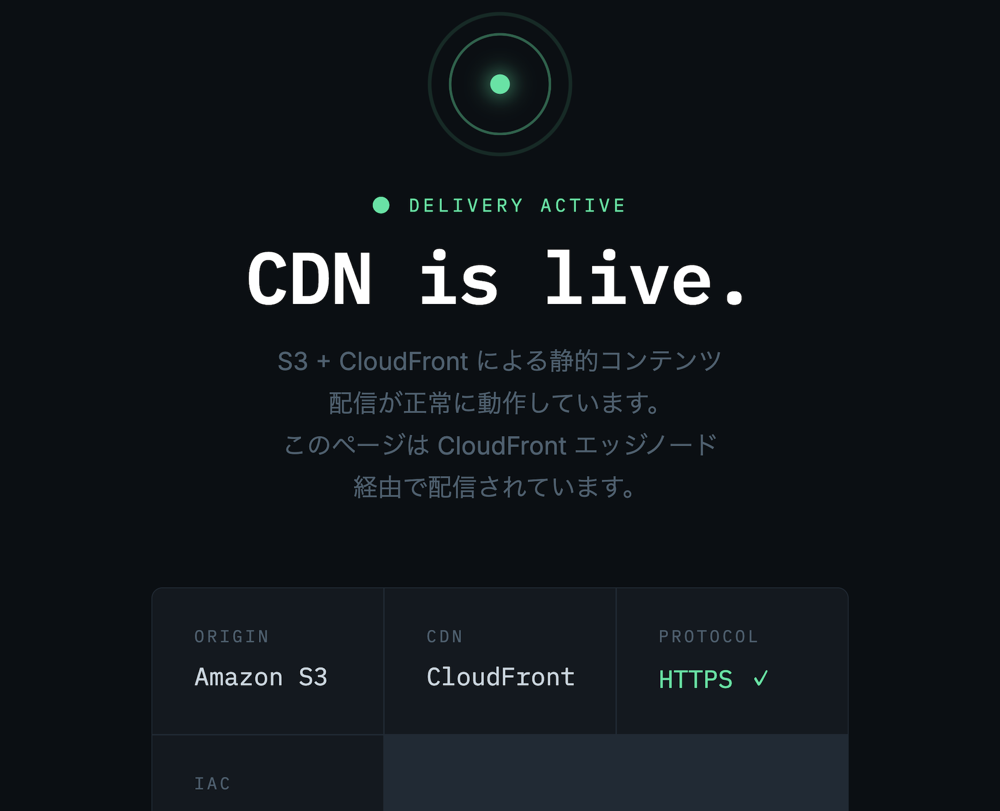
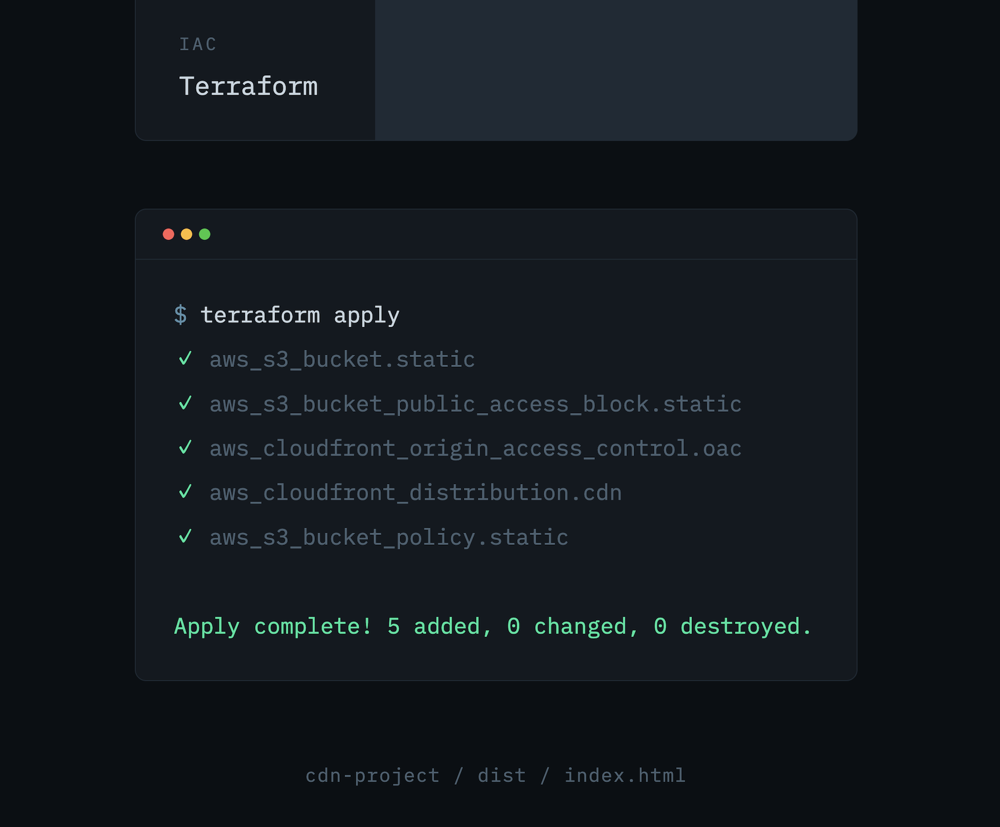
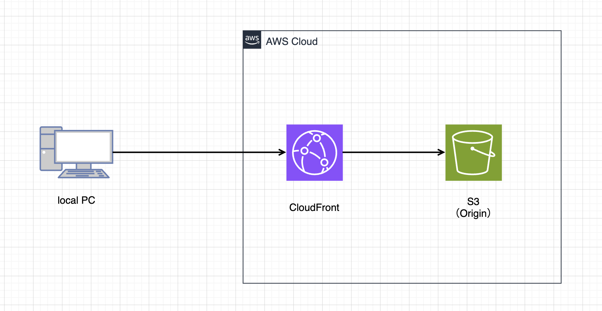

# S3、CloudFrontを用いたCDNサービス

AWS S3、CloudFront を使用して静的コンテンツを配信する CDN 環境を Terraform で構築しました。

---

## 工夫した点

### セキュリティ：S3への直接アクセスを禁止

S3バケットへのパブリックアクセスを完全にブロックし、
CloudFront経由のみコンテンツを配信できる構成にしました。

- **OAC（Origin Access Control）** を使用し、CloudFrontからS3への
  リクエストを署名付きで行うことで、なりすましアクセスを防止
- **バケットポリシー** で CloudFront のみを明示的に許可することで、
  S3 URL での直接アクセスを遮断
- 旧来の OAI（Origin Access Identity）ではなく、AWS推奨の OAC を採用

### インフラ管理：tfstate のリモート管理

`terraform.tfstate` をS3バケットでリモート管理することで、
チーム開発での状態ファイルの競合や紛失を防止しています。

### IaC：Terraform による再現性の確保

全リソースをコードで管理することで、環境の再作成や
設定変更を安全かつ一貫して行えるようにしました。

# プレビュー



## 概要

| 項目 | 内容 |
|------|------|
| プロバイダー | AWS |
| Terraform バージョン | >= 1.15 |
| 主なリソース | S3, CloudFront, IAM |
| 対応リージョン | ap-northeast-1（デフォルト） |

### アーキテクチャ


```
ユーザー
  │
  ▼
CloudFront Distribution（CDN / HTTPS）
  │  ※ OAC (Origin Access Control) で署名
  ▼
S3 Bucket（静的ファイル置き場・パブリックアクセスブロック）
```

---

## 前提条件

- [Terraform](https://developer.hashicorp.com/terraform/install) v1.15 以上
- [AWS CLI](https://docs.aws.amazon.com/cli/latest/userguide/install-cliv2.html) 設定済み
- AWS IAM ユーザーに以下の権限があること
  - `s3:*`
  - `cloudfront:*`
  - `iam:*`（バケットポリシー設定に必要）

---

## ディレクトリ構成

```
.
├── main.tf            # メインリソース定義（S3, CloudFront, OAC, バケットポリシー）
├── variables.tf       # 変数定義
├── outputs.tf         # 出力値（CloudFront URL など）
├── terraform.tf   # プロバイダーの設定（AWS）
├── index.html   # 静的コンテンツ
└── README.md
```

---

## 使い方

### 1. リポジトリのクローン

```bash
git clone https://github.com/Onepiece2424/cdn-project.git
cd cdn-project
```

### 2. 変数の設定

`variables.tf` を作成して値を設定します。

```hcl
project_name = "cdn-project"
```

### 3. 初期化・デプロイ

```bash
# プロバイダーの初期化
terraform init

# 変更内容の確認
terraform plan

# リソースの作成（CloudFront の作成に 数分かかります）
terraform apply
```

### 4. 静的ファイルのアップロード

```bash
# ファイルをS3にアップロード
aws s3 sync ./dist s3://$(terraform output -raw s3_bucket_name)
```

### 5. CloudFront キャッシュの無効化

ファイルを更新した際にキャッシュをクリアします。

```bash
DIST_ID=$(terraform output -raw cloudfront_distribution_id)

aws cloudfront create-invalidation \
  --distribution-id $DIST_ID \
  --paths "/*"
```

---

## 変数一覧

| 変数名 | 型 | デフォルト値 | 説明 |
|--------|-----|-------------|------|
| `project_name` | string | `"cdn-project"` | プロジェクトの名前 |

---

## 出力値一覧

| 出力名 | 説明 |
|--------|------|
| `cloudfront_url` | コンテンツ配信用の CloudFront URL |
| `s3_bucket_name` | 静的ファイルの格納先 S3 バケット名 |

---

## セキュリティについて

- **S3 への直接アクセスは禁止** — パブリックアクセスブロックを有効化し、CloudFront 経由のみ許可
- **OAC（Origin Access Control）を使用** — 旧来の OAI より推奨される方式
- **HTTPS 強制** — HTTP アクセスは自動的に HTTPS へリダイレクト

---

## リソースの削除

```bash
# S3 バケットを空にする（バケットが空でないと削除できない）
aws s3 rm s3://$(terraform output -raw s3_bucket_name) --recursive

# リソースを削除
terraform destroy
```

---
